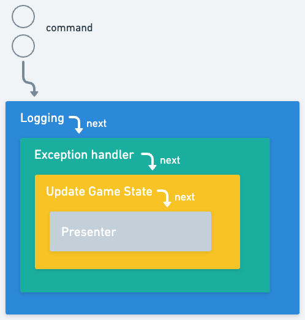
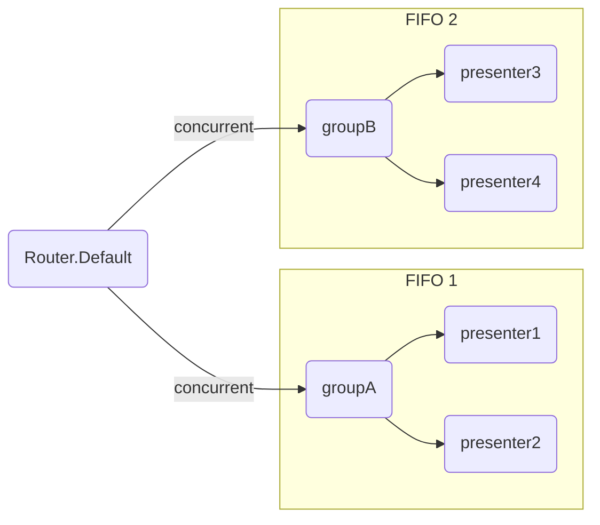
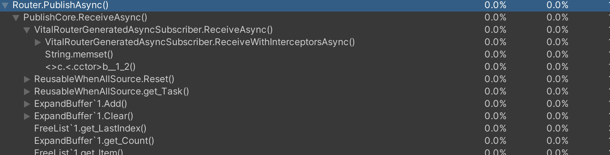
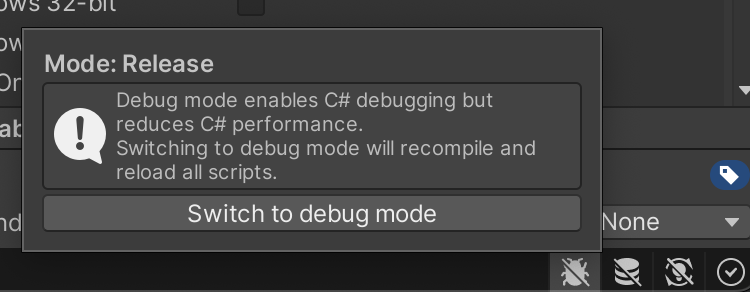
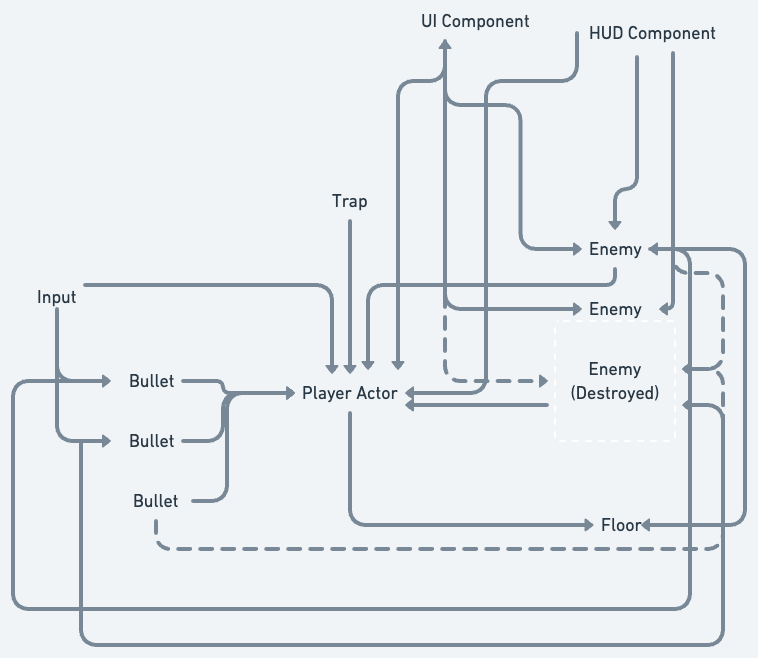
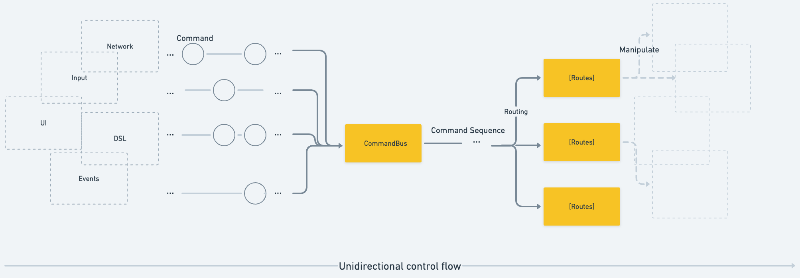
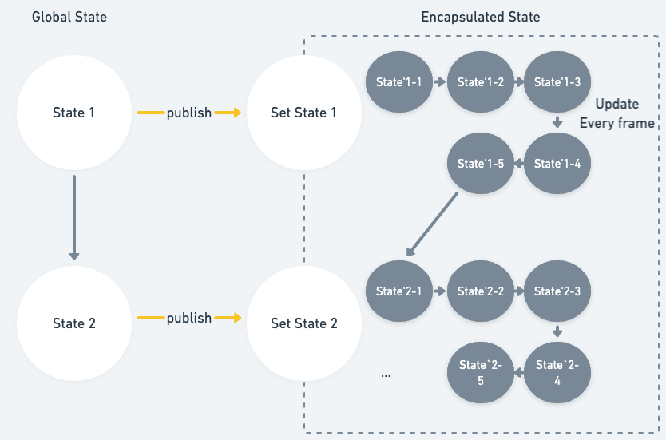
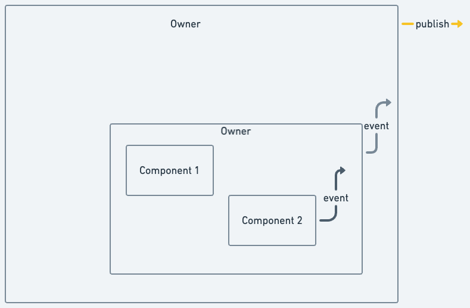

# VitalRouter

[](./LICENSE)


VitalRouter, is a zero-allocation fast in-memory message passing library for games and other complex GUI applications, and the very thin layer that organize application data-flow.
It is focused with Unity and .NET. 
Whether you're an individual developer or part of a larger team, VitalRouter can help you build complex game applications.

Bring fast, declarative routing for your application. 

```cs
[Routes]
[Filter(typeof(Logging))]
[Filter(typeof(ExceptionHandling))]
[Filter(typeof(GameStateUpdating))]
public partial class ExamplePresenter
{
    // Declare event handler
    public void On(FooCommand cmd)
    {
        // Do something ...
    }

    // Declare event handler (async)
    public async UniTask On(BarCommand cmd)
    {
        // Do something for await ...
    }
    
    // Declare event handler with extra filter
    [Filter(typeof(ExtraFilter))]
    public async UniTask On(BuzCommand cmd, CancellationToken cancellation = default)
    {
        // Do something after all filters runs on.
    }
}
```

| Feature                            | Description                                                                                                                                                                                                                                                                                                                                 |
|------------------------------------|---------------------------------------------------------------------------------------------------------------------------------------------------------------------------------------------------------------------------------------------------------------------------------------------------------------------------------------------|
| Declarative routing                | The event delivery destination and inetrceptor stack are self-explanatory in the type definition.                                                                                                                                                                                                                                           |
| Async/non-Async handlers           | Integrate with async/await (with UniTask), and providing optimized fast pass for non-async way                                                                                                                                                                                                                                              |
| With DI and without DI             | Auto-wiring the publisher/subscriber reference by DI (Dependency Injection). But can be used without DI for any project                                                                                                                                                                                                                     |
| Fast, less allocations           | The SourceGenerator eliminates meta-programming overhead and is more attentive to performance. See [Performance](#performance) section for details.                                                                                                                                                                                         |
| Parallel N:N pub/sub               | Built on top of a thread-safe, in-memory, asynchronized  pub/sub system, which is critical in game design.                                                                                                                                                                                                                                  |                                                                                                                                                                                                               
| FIFO (First in first out), Fan-out | Due to the async task's exclusivity control, events can be consumed in sequence. So it can be used as robust FIFO queue. <br /><br />In Game, it is very useful to have events processed in series, VitalRouter provide FIFO constraints. it is possible to fan-out to multiple FIFOs in concurernt. See [FIFO](#fifo) section for details. |

## Table of Contents

- [Installation](#installation)
- [Getting Started](#getting-started)
- [Publish/Subscribe API](#publish-subscribe-api)
- [Interceptors](#interceptors)
- [FIFO](#fifo)
- [DI scope](#di-scope)
- [Command pooling](#command-pooling)
- [R3 integration (experimental)](#r3-integration)
- [Performance](#performance)
- [Concept, Technical Explanation](#concept-technical-explanation)
- [Lisence](#lisence)

## Installation

### NuGet

THe foloowing NuGet packages are available.

| Package | Latest version |
|:------------ |:----------- |
| VitalRouter | [](https://www.nuget.org/packages/ViralRouter/ "Download VitalRouter from NuGet.org") | 
| VitalRouter.Extensions.DependencyInjection | [](https://www.nuget.org/packages/ViralRouter.Extensions.DependencyInjection/ "Download VitalRouter.Extensions.DependencyInjection from NuGet.org") | 

### Unity

Prerequirements:

- Unity 2022.2+
  - This limitation is due to the use of the Incremental Source Generator.
- Install [UniTask](https://github.com/Cysharp/UniTask)
  - Currently, VitalRouter uses UniTask instead of `UnityEngine.Awaitable`. UniTask is a fully featured and fast awaitable implementation.
  - In a future, if `UnityEngine.Awaitable` is enhanced in a future version of Unity, it may be migrated.
- (optional) Install [VContainer](https://github.com/hadashiA/VContainer) >= 1.15.1 
  -  For bringing in DI style, VitalRouter supports Integration with VContainer, a fast and lightweight DI container for Unity.

Then, add git URL from Package Manager:

```
https://github.com/hadashiA/VitalRouter.git?path=/src/VitalRouter.Unity/Assets/VitalRouter#0.7.0
```

## Getting Started

First, define the data types of the event/message you want to dispatch. In VitalRouter this is called  "command".
Any data type that implements `ICommand` will be available as a command, no matter what the struct/class/record is.

```cs
public readonly struct FooCommand : ICommand
{
    public int X { get; init; }
    public string Y { get; init; }
}

public readonly struct BarCommand : ICommand
{
    public Guid Id { get; init; }
    public Vector3 Destination { get; init; }
}
```

Command is a data type (without any functionally). You can call it an event, a message, whatever you like.
Forget about the traditional OOP "Command pattern" :) This library is intended for data-oriented design.

The name "command" is to emphasize that it is a operation that is "published" to your game system entirely. The word is borrowed from CQRS, EventStorming etc.

One of the main advantages of event being a data type is that it is serializable.

```cs
[Serializable]       // < When you want to serialize to a scene or prefab in Unity.
[MessagePackObject]  // < When you want to go through file or network I/O by MessagePack-Csharp.
[YamlObject]         // < When you want to go through configuration files etc by VYaml.
public readonly struct CharacterSpawnCommand : ICommand
{
    public long Id { get; init; }
    public CharacterType Type { get; init; } 
    public Vector3 Position { get; init; }      	
}
```

In game development, the reason why the pub/sub model is used is because that any event will affect multiple sparse objects.
See [Concept, Technical Explanation](#concept-technical-explanation) section to more information.

> [!TIP]
> Here we use the init-only property for simplicity. In your Unity project, you may need to add a definition of type `System.Runtime.CompilerServices.IsExternalInit`as a marker.
> However, this is not a requirement.
> You are welcome to define the datatype any way you like.
 >Modern C# has additional syntax that makes it easy to define such data-oriented types. Using record or record struct is also a good option.
> In fact, even in Unity, you can use the new syntax by specifying `langVersion:11` compiler option or by doing dll separation.  It would be worth considering.

Next, define the class that will handle the commands.

```cs
using VitalRouter;

// Classes with the Routes attribute are the destinations of commands.
[Routes]
public partial class FooPresentor
{
    // This is called when a FooCommand is published.
    public void On(FooCommand cmd)
    {
        // Do something ...
    }

    // This is called when a BarCommand is published.
    public async UniTask On(BarCommand cmd)
    {
        // Do something for await ...
        // Here, by awaiting for async task, the next command will not be called until this task is completed.
    }
}
```

Types with the `[Routes]` attribute are analyzed at compile time and a method to subscribe to Command is automatically generated.

Methods that satisfy the following conditions are eligible.
- public accesibility.
- The argument matches one of the following
    - `ICommand`
    - `ICommand`, `CancellationToken`
    - `ICommand`, `PublishContext`
-  The return value must be `void`, or `UniTask`, `Task`, `ValueTask`, `UnityEngine.Awaitable`.

For example, all of the following are eligible. Method names can be arbitrary.

```cs
public void On(FooCommand cmd) { /* .. */ }
public void On(FooCommand cmd, CancellationToken cancellation) { /* .. */ }
public void On(FooCommand cmd, PublishContext context) { /* .. */ }
public async UniTask On(FooCommand cmd) { /* .. */ }
public async UniTask On(FooCommand cmd, CancellationToken cancellation) { /* .. */ }
public async UniTask On(FooCommand cmd, PublishContext context) { /* .. */ }
```

> [!NOTE] 
> There are no restrictions by Interface but it will generate source code that will be resolved at compile time, so you will be able to follow the code well enough.

Now, when and how does the routing defined here call? There are several ways to make it enable this.

### Manual setup    

If your project does not use DI, set it up in the way of bare bones.

```cs
var presenter = new FooPresenter();
presenter.MapTo(Router.Default);
```

In this case, unmapping is required manually to discard the FooPresenter.

```cs
presenter.UnmapRoutes();
```

Or, handle subscription.

```cs
var subscription = presenter.MapTo(Router.Default);
// ...
subscription.Dispose();
```

In a naive Unity project, the easy way is to make MonoBehaviour into Routes.

```cs
[Routes] // < If routing as a MonoBehaviour
public class FooPresenter : MonoBehaviour
{
    void Start()
    {
        MapTo(Router.Default); // < Start command handling here 
    }
}
```

- `MapTo` is an automatically generated instance method.
- When the GameObject is Destroyed, the mapping is automatically removed.

If you publish the command as follows, `FooPresenter` will be invoked.

```cs
await Router.Default.PublishAsync(new FooCommand
{
    X = 111,
    Y = 222,
}
```

If you want to split routing, you may create a Router instance. As follows.

```cs
var anotherRouter = new Router();
```

```cs
MapTo(anotherRouter);
```

```cs
anotherRouter.PublishAsync(..)
```

### Setup with DI

If DI is used, plain Map/Unmap management and dependency resolution can be automated in a DI container.

#### Setup with DI in Microsoft.Extensions.DependencyInjection

```cs
using VitalRouter;

// Example of using Generic Host
var builder = Host.CreateApplicationBuilder();

builder.Services.AddVitalRouter(routing =>
{
    // Map all `[Routes]` targets in the specified assembly.
    routing.MapAll(GetType().Assembly);
    
    // Map specific class.
    routing.Map<FooPresenter>();
});
```

The instances mapped here are released with to dispose of the DI container.

In this case, publisher is also injectable.

```cs
class HogeController
{
    readonly ICommandPublisher publisher;
    
    public HogeController(ICommandPublisher publisher)
    {
        this.publisher = publisher;
    }

    public void DoSomething()
    {
        publisher.PublishAsync(new FooCommand { X = 1, Y = 2 }).Forget();
    }
}
```
        

#### Setup with DI in VContainer (Unity)

```cs
using VContainer;
using VitalRouter;
using VitalRouter.VContainer;

// VContaner's configuration
public class GameLifetimeScope : LifetimeScope
{
    protected override void Configure(IContainerBuilder builder)
    {
        builder.RegisterVitalRouter(routing =>
        {
            routing.Map<FooPresenter>(); // < Register routing plain class

            // Or, use MonoBehaviour instance with DI
            routing.MapComponent(instance);
            // Or, use MonoBehaviour in the scene
            routing.MapComponentInHierarchy<MyRoutesComponent>();
            // Or, use MonoBehaviour from prefab
            routing.MapComponentInNewPrefab(prefab);
        });			
    }
}
```

The instances mapped here are released with to dispose of the DI container.

In this case, publisher is also injectable.

```cs
class SomeMyComponent : MonoBehaviour
{
    [SerializeField]
    Button someUIBotton;

    ICommandPublisher publisher;

    [Inject]
    public void Construct(ICommandPublisher publisher)
    {
        this.publisher = publisher;
    }

    void Start()
    {
        someUIButton.onClick += ev =>
        {
            publisher.PublishAsync(new FooCommand { X = 1, Y = 2 }).Forget();
        }
    }
}
```

Just register your Component with the DI container. References are auto-wiring.

```diff
public class GameLifetimeScope : LifetimeScope
{
    protected override void Configure(IContainerBuilder builder)
    {
+        builder.RegisterComponentInHierarchy<SomeMyComponent>(Lifetime.Singleton);
	
        builder.RegisterVitalRouter(routing =>
        {
            routing.Map<FooPresenter>();
        });			
    }
}

```

> [!NOTE]
> This is a simple demonstration.
> If your codebase is huge, just have the View component notify its own events on the outside, rather than Publish directly. And maybe only the class responsible for the control flow should Publish.

## Publish/Subscribe API

`ICommandPublisher` has an awaitable publish method.

```cs
ICommandPublisher publisher = Router.Default;

await publisher.PublishAsync(command);
await publisher.PublishAsync(command, cancellationToken);
```

If you await `PublishAsync`, you will await until all Subscribers (`[Routes]` class etc.) have finished all processing.

```cs
await publisher.PublishAsync(command1);  // Wait until all subscribers have finished processing command1
await publisher.PublishAsync(command2);  // Wait until all subscribers have finished processing command2
// ...
```


Note that by default, when Publish is executed in parallel, Subscribers is also executed in parallel.

```cs
publisher.PublishAsync(command1).Forget(); // Start processing command1 immediately
publisher.PublishAsync(command2).Forget(); // Start processing command2 immediately
publisher.PublishAsync(command3).Forget(); // Start processing command3 immediately
// ...
```

If you want to treat the commands like a queue to be sequenced, see [FIFO](#fifo) section for more information.

Of course, if you do `await`, you can try/catch all subscriber/routes exceptions.

```cs
try
{
    await publisher.PublishAsync(cmd);
}
catch (Exception ex)
{
    // ...
}
```

A non-generic version of PublishAsync is also available for restoring commands saved as a collection.

```cs
var commands = new List<ICommand> { fooCommand, barCommand, ..  };

foreach (var cmd in commands)
{
    await publisher.PublishAsync(cmd.GetType(), cmd);
}
```

`ICommandSubscriber` provides a low-level API for consuming Commands as events.
You can use this directly without using the [Routes] attribute.

```cs
ICommandSubscribale router = Router.Default;

// Subscribe handler via lambda expression
router.Subscribe<FooCommand>(cmd => { /* ... */ });

// Subscribe async handler via lambda expression
router.Subscribe<FooCommand>(async cmd => { /* ... */ });

// Subscribe handler
router.Subscribe(Subscriber);

class Subscriber : ICommandSubscriber
{
    pubilc void Receive<T>(T cmd, PublishContext ctx) where T : ICommand { /* ... */ }
}

// Subscribe async handler
router.Subscribe(AsyncSubscriber);

class AsyncSubscriber : IAsyncCommandSubscriber
{
    pubilc UniTask Receive<T>(T cmd, PublishContext ctx) where T : ICommand { /* ... */ }
}

// Add interceptor via lambda expresion
router.Filter<FooCommand>(async (cmd, ctx, next) => { /* ... */ });
```

`PublishContext` has the following structure.

```cs
public class PublishContext
{
    /// <summary>
    /// Cancellation token set by Publisher. Used to cancel this entire Publish.
    /// </summary>
    public CancellationToken CancellationToken { get; set; }

    /// <summary>
    /// The Member name of the caller who published. `[CallerMemberName]` is the source.
    /// </summary>
    public string? CallerMemberName { get; set; }

    /// <summary>
    /// The file full path of the caller who published. `[CallerFilePAth]` is the source.
    /// </summary>
    public string? CallerFilePath { get; set; }

    /// <summary>
    /// The line number of the caller who published. `[CallerLineNumber]` is the source.
    /// </summary>
    public int CallerLineNumber { get; set; }
}
```


## Interceptors

Interceptors can intercede additional processing before or after the any published command has been passed and consumed to subscribers.	



### Create a interceptor

Arbitrary interceptors can be created by implementing `ICommandInterceptor`.

Example 1:  Some kind of processing is interspersed before and after the command is consumed.

```cs
class Logging : ICommandInterceptor
{
    public async UniTask InvokeAsync<T>(  
        T command,  
        CancellationToken cancellation,  
        Func<T, CancellationToken, UniTask> next)  
        where T : ICommand  
    {  
        UnityEngine.Debug.Log($"Start {typeof(T)}");	
        // Execute subsequent routes.	
        await next(command, cancellation);		
        UnityEngine.Debug.Log($"End   {typeof(T)}");
    }		
}
```

Example 2:  try/catch all subscribers exceptions.

```cs
class ExceptionHandling : ICommandInterceptor
{
    public async UniTask InvokeAsync<T>(  
        T command,  
        CancellationToken cancellation,  
        Func<T, CancellationToken, UniTask> next)  
        where T : ICommand  
    {  
        try
        {
            await next(command, cancellation);
        }
        catch (Exception ex)
        {
            // Error tracking you like			
            UnityEngine.Debug.Log($"oops! {ex.Message}");			
        }
    }		
}
```

Example 3:  Filtering command.

```cs
class MyFilter : ICommandInterceptor
{
    public async UniTask InvokeAsync<T>(  
        T command,  
        CancellationToken cancellation,  
        Func<T, CancellationToken, UniTask> next)  
        where T : ICommand  
    {  
        if (command is FooCommand { X: > 100 } cmd) 
        {
            // Deny. Skip the rest of the subscribers.
            return;
        }
        // Allow.
        await next(command, cancellation);
    }		
}
```

### Configure interceptors

There are three levels to enable interceptor

1. Apply globally to the `Router`. 
2. Apply it to all methods in the `[Routes]` class.
3. Apply only to specific methods in the `[Routes]` class.

```cs
// 1. Apply globally to the router.
Router.Default
    .Filter(new Logging())
    .Filter(new ErrorHandling);
```

```cs
// 1. Apply to the router with VContaienr.
builder.RegisterVitalRouter(routing => 
{
    routing.Filters.Add<Logging>();
    routing.Filters.Add<ErrorHandling>();
});
```

```cs
// 1. Apply to the router with Microsoft.Extensions.DependencyInjection.
builder.AddVitalRouter(routing => 
{
    routing.Filters.Add<Logging>();
    routing.Filters.Add<ErrorHandling>();
});
```

```cs
[Routes]
[Filter(typeof(Logging))] // 2. Apply to the type
public partial class FooPresenter
{
    [Filter(typeof(ExtraInterceptor))] // 3. Apply to the method
    public void On(CommandA cmd)
    {
        // ...
    }
}
```

All of these are executed in the order in which they are registered, from top to bottom.

If you take the way of 2 or 3, the Interceptor instance is resolved as follows.

- If you are using DI, the DI container will resolve this automatically.
- if you are not using DI, you will need to pass the instance in the `MapTo` call.
	- ```cs
	  MapTo(Router.Default, new Logging(), new ErrorHandling());
	  ```
	- ```cs
	  // auto-generated
	  public Subscription MapTo(ICommandSubscribable subscribable, Logging interceptor1, ErrorHandling interceptor2) { /* ... */ }
	  ```
      
### C# 11 Generic attribute

If you are using Unity 2022.3.12f1 or newer, you can use `langVersion:preview` allows parts of C# 11 features.

If C# 11 is available, generic attributes can be used for interceptor settings.

``` csharp
[Filter<AInterceptor>] // < Generic attribute
public partial class FooPresenter
{
    // ...
}
```

How to enable C# 11 in Unity 2022.3.12f1 or newer:

1. Setup the C# compiler for unity.
  - Add a text file named csc.rsp with the following contents under your Assets/.
    - ```
      -langVersion:preview -nullable
     ```
  - Note:
    - If you are using assembly definition, put it in the same folder as the asmdef.
     
2. Setup the C# compiler for your IDE.
  - Install [CsProjModifier](https://github.com/Cysharp/CsprojModifier)
  - Add a text file named LangVersion.props with the following contents
    - ```xml
      <Project xmlns="http://schemas.microsoft.com/developer/msbuild/2003">
        <PropertyGroup>
          <LangVersion>11</LangVersion>
          <Nullable>enable</Nullable>
        </PropertyGroup>
      </Project> 
      ```
  - Open Project Settings and [C# Project Modifier] section under the [Editor].
  - Add the .props file you just created, to the list of [Additional project imports].

## FIFO

If you want to treat the commands like a queue to be sequential processing, do the following:

```cs
// Set sequential constraint to the globally.
Router.Default.Filter(CommandOrdering.Sequential);

// Create sequential router.
var fifoRouter = new Router(CommandOrdering.Sequential);

// Configure sequential routing via DI
builder.RegisterVitalRouter(routing => 
{
    routing.CommandOrdering = CommandOrdering.Sequential;
});
```

In this case, the next command will not be delivered until all `[Routes]` classes and Interceptors have finished processing the Command.

In other words, per Router, command acts as a FIFO queue for the async task.

```cs
publisher.PublishAsync(command1).Forget(); // Start processing command1 immediately
publisher.PublishAsync(command2).Forget(); // Queue command2 behaind command1
publisher.PublishAsync(command3).Forget(); // Queue command3 behaind command2
// ...
```

```cs
publisher.Enqueue(command1); // Start processing command1 immediately
publisher.Enqueue(command2); // Queue command2 behaind command1
publisher.Enqueue(command3); // Queue command3 behaind command2
// ...
```


### Fan-out

When FIFO mode, if you want to group the awaiting subscribers, you can use `FanOutInterceptor`

```cs
var fanOut = new FanOutInterceptor();
var groupA = new Router(CommandOrdering.Sequential)
var groupB = new Router(CommandOrdering.Sequential);

fanOut.Add(groupA);
fanOut.Add(groupB);

Router.Default.Filter(fanOut);

// Map routes per group

presenter1.MapTo(groupA);
presenter2.MapTo(groupA);

presente3.MapTo(groupB);
presente4.MapTo(groupB);
```

With Microsoft.Extensions.DependencyInjection

```cs
builder.AddVitalRouter(routing =>
{
    routing
        .FanOut(groupA =>
        {
            groupA.Ordering = CommandOrdering.FirstInFirstOut;
            groupA.Map<Presenter1>();
            groupA.Map<Presenter2>();
        })    
        .FanOut(groupB =>
        {
            groupB.Ordering = CommandOrdering.FirstInFirstOut;
            groupB.Map<Presenter3>();
            groupB.Map<Presenter4>();
        })                
});
```

With VContainer (Unity)

```cs
public class SampleLifetimeScope : LifetimeScope
{
    public override void Configure(IContainerBuilder builder)
    {                
        builder.RegisterVitalRouter(routing =>
        {
            routing
                .FanOut(groupA =>
                {
                    groupA.Ordering = CommandOrdering.FirstInFirstOut;
                    groupA.Map<Presenter1>();
                    groupA.Map<Presenter2>();
                })    
                .FanOut(groupB =>
                {
                    groupB.Ordering = CommandOrdering.FirstInFirstOut;
                    groupB.Map<Presenter3>();
                    groupB.Map<Presenter4>();
                })                
        });
    }
}
```

Now we have the structure shown in the following:



## DI scope

VContainer can create child scopes at any time during execution.

`RegisterVitalRouter` inherits the Router defined in the parent. 
For example,

```cs
public class ParentLifetimeScope : LifetimeScope  
{  
    protected override void Configure(IContainerBuilder builder)  
    {    
        builder.RegisterVitalRouter(routing =>  
        {  
            routing.Map<PresenterA>();  
        });
        
        builder.Register<ParentPublisher>(Lifetime.Singleton);
    }  
}
```

```cs
public class ChildLifetimeScope : LifetimeScope  
{  
    protected override void Configure(IContainerBuilder builder)  
    {    
        builder.RegisterVitalRouter(routing =>  
        {  
            routing.Map<PresenterB>();  
        });  
        
        builder.Register<MyChildPublisher>(Lifetime.Singleton);
    }  
}
```

- When an instance in the parent scope publishes used `ICommandPublisher`, PresenterA and PresenterB receive it.
- When an instance in the child scope publishes `ICommandPublisher`, also PresenterA and PresenterB receives.

If you want to create a dedicated Router for a child scope, do the following.

```diff
builder.RegisterVitalRouter(routing =>  
{
+    routing.Isolated = true;
    routing.Map<PresenterB>();  
});  
```

## Command Pooling

If Command is struct, VitalRouter avoids boxing, so no heap allocation occurs. This is the reson of using sturct is recommended.

In some cases, however, you may want to use class.
Typically, when Command is treated as a collection element, boxing is unavoidable.

So we support the ability to pooling commands when classes are used.

```cs
public class MyBoxedCommmand : IPoolableCommand
{
    public ResourceA ResourceA { ge; set; }

    void IPoolableCommand.OnReturnToPool()
    {
        ResourceA = null!;
    }
}
```

### Rent from pool

```cs
// To publish, use CommandPool for instantiation.
var cmd = CommandPool<MyBoxedCommand>.Shared.Rent(() => new MyBoxedCommand());

// Lambda expressions are used to instantiate objects that are not in the pool. Any number of arguments can be passed from outside.
var cmd = CommandPool<MyBoxedCommand>.Shared.Rent(arg1 => new MyBoxedCommand(arg1), extraArg);
var cmd = CommandPool<MyBoxedCommand>.Shared.Rent((arg1, arg2) => new MyBoxedCommand(arg1, arg2), extraArg1, extraArg2);
// ...

// Configure value
cmd.ResourceA = resourceA;

// Use it
publisher.PublishAsync(cmd);
```

### Return to pool

```cs
// It is convenient to use the `CommandPooling` Interceptor to return to pool automatically.
Router.Default.Filter(CommandPooling.Instance);


// Or, return to pool manually.
CommandPool<MyBoxedCommand>.Shard.Return(cmd);
```

## R3 integration

[Cysharp/R3](https://github.com/Cysharp/R3) is a new Rx (Reactive extensions) library that works with Unity.
It is the successor to the popular UniRx, with a more modern implementation, a refined API, and an abstraction layer.
Check the R3 documentation for more details.

VitalRouter supports experimental integration with R3.

```cs
publisher.AsObservable<TCommand>() // Convert pub/sub to R3 Observable
```

```cs
// Subscibe and bind publisher.
observable
    .Select(x => new FooCommand { X = x }
    .SubscribeToPublish(Router.Default);
    
// Subscibe and bind publisher and await for publishing all. (PublishAsync().Forget())
await observable
    .Select(x => new FooCommand { X = x }
    .ForEachPublishAndForgetAsync(Router.Default);
    
// Subscibe and bind publisher and await for publishing all. (await PublishAsync() one by one)
await observable
    .Select(x => new FooCommand { X = x }
    .ForEachPublishAndAwaitAsync(Router.Default);
```


## Performance

### Heap allocations

There is zero extra heap allocation due to publish; if ICommand is struct, no boxing occurs. Also, if interceptor is used, type-specific allocations occur the first time, but are cached the second and subsequent times.



So it could be used for very granular messaging in games.

> [!WARNING]
> There is a difference in the optimization of the async method between the debug build and the release build.
> If you want to check the allocations in production, you should look at the Release build.
> 
> Also, refer to the UniTask documentation for.

### Static type caching

By source generator, type of ICommand branches are pre-generated by static type caching.
This is particularly fast compared to switch statements and dictionaries.

```csharp
// Auto-generated example, Determination of subscriber
MethodTable<global::CharacterEnterCommand>.Value = static (source, command, cancellation) => source.On(command);
MethodTable<global::CharacterMoveCommand>.Value = static (source, command, cancellation) => source.On(command);

// Auto-generated example, Determination of interceptor
MethodTable<global::CharacterEnterCommand>.InterceptorFinder = static self => self.interceptorStackDefault;
MethodTable<global::CharacterMoveCommand>.InterceptorFinder = static self => self.interceptorStackDefault;
``` 

### Subscribers handling

The challenge in implementing a thread-safe event handler is the contention for the subscriber collection: we want to enumerate all subscribers as they are dynamically added/removed.

The easiest solution would be to make a copy of each case just before it is enumerated. (Like `ToArray`. `Immutable Collection`, and so on).
In this case, however, allocation occurs.

In early implementations of VitalRouter, only FIFOs were implemented, so two collections were prepared in advance. Like double buffering.

The current implementation uses Free list.
When an element is removed, its address becomes null and is reused later.
When enumerating all cases, it does not take a lock and just "ignores" any nulls.
This slows down enumeration when there is room, but does not require locking.

Note that this idea is mostly borrowed from [Cysharp/R3](https://github.com/Cysharp/R3).

## Concept, Technical Explanation

### Unidirectional control flow

Unity is a very fun game engine that is easy to work with, but handling communication between multiple GameObjects is a difficult design challenge.

In the game world, there are so many objects working in concert: UI, game system, effects, sounds, and various actors on the screen.

It is common for an event fired by one object to affect many objects in the game world.
If we try to implement this in a naive OOP way, we will end up with complex... very complex N:N relationships.

More to the point, individual objects in the game are created and destroyed at a dizzying rate during execution, so this N:N would tend to be even more complex!



There is one problem. There is no distinction between "the one giving the orders" and "the one being given the orders."
In the simplicity of Unity programming, it is easy to mix up the object giving the orders and the object being given the orders.
This is one of the reasons why game design is so difficult.

When the relationship is N:N, bidirectional binding is almost powerless. This is because it is very fat for an object to resolve references to all related objects. Moreover, they all repeat their creation.

Most modern GUI application frameworks recommend an overall unidirectional control flow rather than bidirectional binding.



Games are more difficult to generalize than GUIs. However, it is still important to organize the "control flow".

### Distinguish between publishable and encapsulated states

A major concern in game development is creating a Visualize Component that is unique to that game.

The Component we create has very detailed state transitions. It will move every frame. Maybe.
It will have complex parent-child relationships. Maybe.

But we should separate this very detailed state management from the state that is brought to the entire game system and to which many objects react.



It is the latter fact that should be "publich".

Each View Component should hide its own state inside.

So how should granular components expose their own events to the outside world?  Be aware of ownership. An object with ownership of a fine-grained object communicates further outside of it.



The "Controller" in MVC is essentially not controlled by anyone. It is the entry point of the system.
VitalRouter does not require someone to own the Controller, only to declare it in an attribute. So it encourages this kind of design.

### Data-oriented

An important advantage of giving a type for each type of event is that it is serializable.

For example,
- If you store your commands in order, you can implement game replays later by simply re-publishing them in chronological order.
- Commands across the network, your scenario data, editor data, whatever is datamined, are the same input data source.

A further data-oriented design advantage is the separation of "data" from "functionality.

The life of data is dynamic.
Data is created/destroyed when certain conditions are met in a game.
On the other hand, "functionality" has a static lifetime.
This is a powerful tool for large code bases.

## LISENCE

MIT

## AUTHOR

@hadashiA
