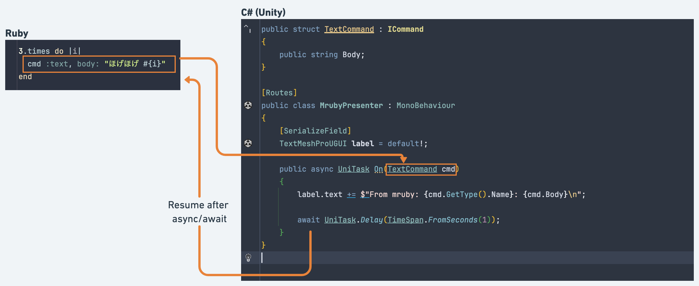

# VitalRouter

[](./LICENSE)


VitalRouter is a C# library for zero-allocation, in-memory messaging on the client-side.

It works on any platform where C# runs, but is specifically designed for client-side applications, particularly in games with Unity, or where event propagation can become complex.

By simply adding an Attribute, you can achieve asynchronous handlers, asynchronous middleware, sequence control, and more. Roslyn SourceGenerator generates high-performance code with zero allocations. It can function as a thin framework that promotes a unidirectional control flow.

```csharp
[Routes]
[Filter(typeof(Logging))]
[Filter(typeof(ExceptionHandling))]
[Filter(typeof(GameStateUpdating))]
public partial class ExamplePresenter
{
    // Declare event handler
    [Route]
    void On(FooCommand cmd)
    {
        // Do something ...
        Console.WriteLine("foo !")
    }

    // Declare event handler (async)
    [Route] 
    async UniTask On(BarCommand cmd)
    {
        // Do something for await ...
    }
    
    // Declare event handler with extra filter
    [Route]
    [Filter(typeof(ExtraFilter))]
    async UniTask On(BuzCommand cmd, CancellationToken cancellation = default)
    {
        // Do something after all filters runs on.
    }
       
    // Declare event handler with specifies behavior when async handlers are executed concurrently
    [Route(CommandOrdering.Sequential)]
    async UniTask On(BuzCommand cmd, CancellationToken cancellation = default)
    {
        // Do something after all filters runs on.
    }
}
```

```cs
// Subscribe with async
var subscription = router.SubscribeAwait<FooCommand>(async (cmd, cancellationToken) => { /* ... */ }, CommandOrdering.Sequential);

// lambda interceptors
router
    .WithFilter<FooCommand>(async (x, context) =>
    {
        if (condition) await next(x, context);
    })
    .Subscribe<FooCommand>(cmd => { /* .. */ });
```

```cs
var router = new Router();

var presenter = new ExamplePresenter();
presenter.MapTo(router);

await router.PublishAsync(new FooCommand(/* ... */));
// foo !
```

In games, or complex GUI application development, patterns such as central event aggregator/message broker/mediator are powerful patterns to organize N:N relationships.
Assembling an asynchronous function pipeline can be even more effective.

### Features

- Zero allocation message passing
- Thread-safe
- Pub/Sub, Fan-out
- Async / Non-async handlers
- Fast declarative routing pattern
- Naive event handler pattern
- Async interceptor pipelines
    - Parallel, queueing, or other sequential control.
- DI friendly. Also support without DI.
- **Optional Extensions**
    - UniTask support
    - R3 integration
    - MRuby scripting

## Documentation

Visit [vitalrouter.hadashikick.jp](https://vitalrouter.hadashikick.jp) to see the full documentation.

## Installation

> [!NOTE]
> Starting with version 2.0, distribution in Unity has been changed to NuGet.
> For documentation prior to version 1.x, please refer to [v1](https://github.com/hadashiA/VitalRouter/tree/v1) branch.

The following NuGet packages are available.

| Package                                    | Latest version                                                                                                                                                   |
|:-------------------------------------------|:-----------------------------------------------------------------------------------------------------------------------------------------------------------------|
| VitalRouter                                | [](https://www.nuget.org/packages/VitalRouter)                                                               | 
| VitalRouter.Extensions.DependencyInjection | [](https://www.nuget.org/packages/VitalRouter.Extensions.DependencyInjection) | 
| VitalRouter.R3                             | [](https://www.nuget.org/packages/VitalRouter.R3)                                                         |
| VitalRouter.MRuby                          | [](https://www.nuget.org/packages/VitalRouter.MRuby)                                                   |

### Unity

> [!NOTE]
> Requirements: Unity 20222.2+
> This limitation is due to the use of the Incremental Source Generator.

1. Install [NugetForUnity](https://github.com/GlitchEnzo/NuGetForUnity).
2. Open the NuGet window by going to NuGet > Manage NuGet Packages, after search for the "VitalRouter" packages, and install it.
3. **Optional**
    - The following extensions for Unity are available from the Unity Package Manager:
        - ```
          https://github.com/hadashiA/VitalRouter.git?path=/src/VitalRouter.Unity/Assets/VitalRouter#2.0.5
          ```
        - Install UniTask >= 2.5.5
            - If [UniTask](https://github.com/Cysharp/UniTask) is installed, `VITALROUTER_UNITASK_INTEGRATION` flag is turned on and the optimized GC-free code is executed.
            - See [UniTask Integration](./website/docs/extensions/unitask.md) section for more details.
        - Install VContainer >= 1.16.6
            - For bringing in DI style, VitalRouter supports Integration with VContainer, a fast and lightweight DI container for Unity.
            - See [DI](./website/docs/di/vcontainer.md) section for more details.

## Async interceptor pipeline

Pipelining of async interceptors for published messages is possible. This is a general strong pattern for data exchange.


[Read more](https://vitalrouter.hadashikick.jp/pipeline/interceptor)

## UniTask Integration

UniTask is a fast async/await extension for Unity. VitalRouter actively supports UniTask.

[Read more](https://vitalrouter.hadashikick.jp/extensions/unitask)

## R3 Integration

R3 is the next generation Reactive Extensions implementation in the C# world. It is an excellent alternative to asynchronous streams, but also an excellent alternative to local events.

VitalRouter supports the ability to work with R3.

[Read more](https://vitalrouter.hadashikick.jp/extensions/r3)

## MRuby scripting

It is very powerful if the publishing of commands can be controlled by external data.

For example, when implementing a game scenario, most of the time we do not implement everything in C# scripts. It is common to express large amounts of text data, branching, flag management, etc. in a simple scripting language or data format.

VitalRouter offers an optional package for this purpose before integrating [mruby](https://github.com/mruby/mruby). ([blog](https://medium.com/@hadashiA/vitalrouter-mruby-generic-ruby-scripting-framework-for-unity-d1b2234a5c33) / [blog (Japanease)](https://hadashikick.land/tech/vitalrouter-mruby)

Fiber in mruby and async/await in C# are fully integrated.



[Read more](https://vitalrouter.hadashikick.jp/extensions/mruby/intro)

## LISENCE

MIT

## AUTHOR

@hadashiA
