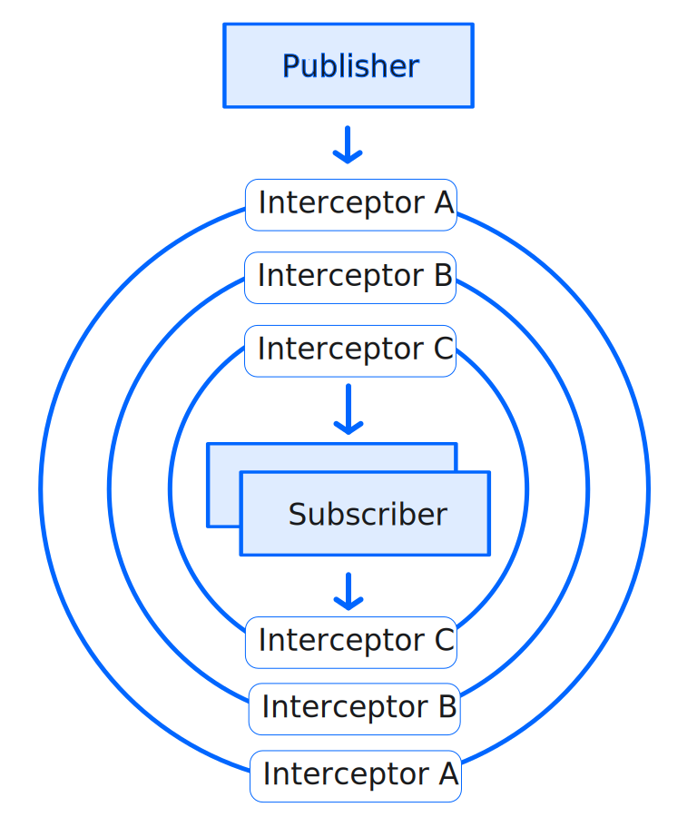
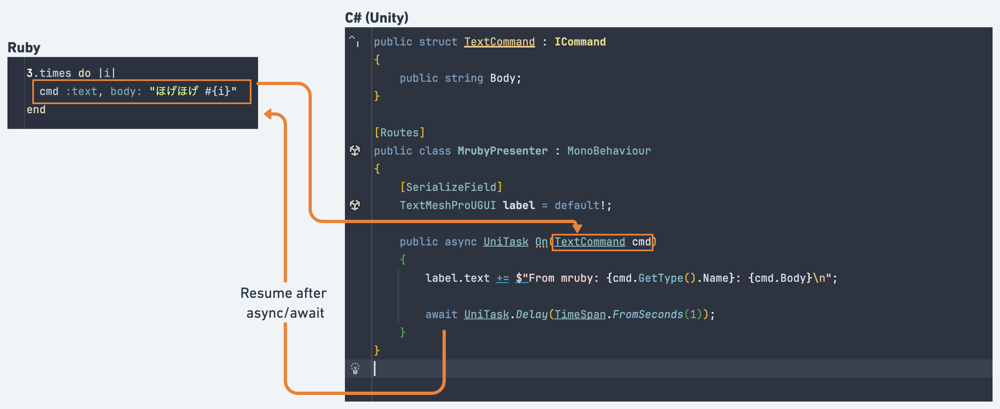

# VitalRouter

[](./LICENSE)


VitalRouter is a high-performance, zero-allocation in-memory messaging library for C#. It is specifically designed for environments where performance and decoupling are critical, such as Unity games or complex .NET applications.

By using simple attributes, you can implement asynchronous handlers, middleware (interceptors), and advanced sequence control. VitalRouter leverages Roslyn Source Generators to produce highly efficient code, promoting a clean, unidirectional control flow with minimal overhead.

## Documentation

Visit [vitalrouter.hadashikick.jp](https://vitalrouter.hadashikick.jp) for the full documentation.

## Key Features

- **Zero Allocation**: Optimized for high-frequency messaging without GC pressure.
- **Thread-Safe**: Designed for safe use across multiple threads.
- **Unidirectional Flow**: Promotes a predictable data flow through your application.
- **Declarative Routing**: Use attributes like `[Routes]` and `[Route]` to define handlers.
- **Async Interceptor Pipeline**: Build sophisticated message processing chains.
- **Versatile Compatibility**: Works seamlessly in both Unity and standard .NET projects.
- **DI Integration**: Native support for VContainer (Unity) and Microsoft.Extensions.DependencyInjection.

---

## Core Concepts

VitalRouter follows a simple messaging flow. A **Publisher** sends a **Command** to a **Router**, which then dispatches it through optional **Interceptors** to one or more **Handlers**.


```mermaid
---
config:
  theme: dark
---
graph LR
    Publisher[Publisher] -- PublishAsync --> Router[Router]
    subgraph Pipeline
        Router -- next --> Interceptor1[Interceptor A]
        Interceptor1 -- next --> Interceptor2[Interceptor B]
    end
    Interceptor2 -- Invoke --> Handler[Handler/Presenter]
```

### 1. Define a Command
Commands are lightweight data structures representing events or actions.

```csharp
// record structs are recommended for zero-allocation messaging
public readonly record struct MoveCommand(Vector3 Destination) : ICommand;
```

> [!TIP]
> **AOT/HybridCLR Note**: While `record struct` is valid, ensure your AOT metadata is correctly generated for iOS/AOT environments if using tools like HybridCLR.

### 2. Create a Handler (Presenter)
Use the `[Routes]` attribute on a `partial` class to receive commands.

```csharp
[Routes]
public partial class PlayerPresenter
{
    // Use ValueTask for performance in pure .NET projects
    [Route]
    public async ValueTask On(MoveCommand cmd)
    {
        await MoveToAsync(cmd.Destination);
    }

    // Use UniTask for Unity-specific async handling
    [Route]
    public async UniTask On(SomeAsyncCommand cmd)
    {
        await DoSomethingAsync();
    }
}
```

### 3. Map and Publish
Connect your handler to a router and start sending commands.

```csharp
var router = new Router();
var presenter = new PlayerPresenter();

// MapTo returns a Subscription (IDisposable)
using var subscription = presenter.MapTo(router);

// Publish a message
await router.PublishAsync(new MoveCommand(new Vector3(1, 0, 0)));

```

### (Optional) Simple Pub/Sub
You can also subscribe with lambdas instead of using the source generator.

```csharp
// Simple subscription
router.Subscribe<MoveCommand>(cmd => { /* ... */ });

// Async subscription with ordering
router.SubscribeAwait<MoveCommand>(async (cmd, ct) =>
{
    await DoSomethingAsync();
}, CommandOrdering.Sequential);

// Inline interceptors (Filters)
//
// `WithFilter(...)` returns a derived child router that owns the given filter.
// Subscribers registered on the child receive commands published on the parent
// (with the filter applied), just like an Rx `Where` chain forwards items from
// its source.
router
    .WithFilter<MoveCommand>(async (cmd, context, next) =>
    {
        Console.WriteLine("Before");
        await next(cmd, context);
        Console.WriteLine("After");
    })
    .Subscribe(cmd => { /* ... */ });

// Publishing on the parent triggers the filter for subscribers on the child:
await router.PublishAsync(new MoveCommand(...));
// → "Before" → handler → "After"
```

## Unity Integration

VitalRouter is highly optimized for Unity, especially when combined with UniTask.

### MonoBehaviour Example
When using `MapTo` in a `MonoBehaviour`, always bind the subscription to the object's lifecycle.

```csharp
[Routes]
public partial class CharacterController : MonoBehaviour
{
    private void Start()
    {
        // Bind the subscription to this GameObject's lifecycle
        this.MapTo(Router.Default).AddTo(destroyCancellationToken);
    }

    [Route]
    public void On(MoveCommand cmd)
    {
        transform.position = cmd.Destination;
    }
}
```

> [!IMPORTANT]
> **Assembly Definition (.asmdef)**: You must reference `VitalRouter` in your `.asmdef` file for the Source Generator to process your `[Routes]` attributes.

---

## UniTask Integration
UniTask is a fast async/await library for Unity. VitalRouter actively supports UniTask.
Requires: UniTask >= 2.5.5

> [!TIP]
> If UniTask is installed, the `VITALROUTER_UNITASK_INTEGRATION` flag is defined automatically, enabling optimized GC-free code paths.

[Read more](https://vitalrouter.hadashikick.jp/extensions/unitask)

---

## Installation

### Requirements
- **Unity projects**: Unity 2022.2+ required for incremental source generator support.
- **Standard .NET projects**: .NET 6.0+.

### Packages

| Package                                      | Purpose                                      | Latest version                                                                                                                                                   |
| :------------------------------------------- | :------------------------------------------- | :--------------------------------------------------------------------------------------------------------------------------------------------------------------- |
| `VitalRouter`                                | Core messaging and source-generated routing  | [](https://www.nuget.org/packages/VitalRouter)                                                               |
| `VitalRouter.Extensions.DependencyInjection` | DI registration for standard .NET apps       | [](https://www.nuget.org/packages/VitalRouter.Extensions.DependencyInjection) |
| `VitalRouter.R3`                             | Bridge commands to R3 reactive streams       | [](https://www.nuget.org/packages/VitalRouter.R3)                                                         |
| `VitalRouter.MRuby`                          | Publish and handle commands from MRuby scripts | [](https://www.nuget.org/packages/VitalRouter.MRuby)                                                   |

### Unity Installation

> [!NOTE]
> Since version 2.0, Unity distribution has moved to NuGet.

1. Install [NuGetForUnity](https://github.com/GlitchEnzo/NuGetForUnity).
2. Search for and install the `VitalRouter` packages in the NuGet window.

**Optional Extensions for Unity**

Install the following package to use Unity-specific features, including integration with VContainer/UniTask.

```text
https://github.com/hadashiA/VitalRouter.git?path=/src/VitalRouter.Unity/Assets/VitalRouter#2.6.0
```

---

## Advanced Features

### Async Interceptor Pipeline
You can pipeline async interceptors for published messages. This is a powerful general-purpose pattern for message processing.



[Read more](https://vitalrouter.hadashikick.jp/pipeline/interceptor)

### R3 Integration
R3 is a next-generation Reactive Extensions implementation for C#. VitalRouter integrates with R3.

[Read more](https://vitalrouter.hadashikick.jp/extensions/r3)

### MRuby Scripting
Control command publishing via external MRuby scripts. MRuby fibers and C# async/await are fully integrated.



[Read more](https://vitalrouter.hadashikick.jp/extensions/mruby/intro)

---

## Appendix: Best Practices

Based on large-scale production usage (e.g., HybridFrame):

1. **Prefer record structs**: For commands that are pure data, `record struct` provides equality comparison and zero-allocation benefits.
2. **Explicit Lifecycles**: Always use `.AddTo(destroyCancellationToken)` or manual `Dispose()` to avoid memory leaks and ghost event handling.
3. **UniTask for Unity**: Use `UniTask` or `UniTaskVoid` as return types in Unity handlers to leverage optimized pooling. Use `ValueTask` for pure .NET projects.
4. **Contextual Metadata**: Use `PublishContext` for cross-cutting concerns (logging IDs, cancellation tokens, user permissions) instead of adding those fields to your command structs.
5. **Sequential by Default for UI**: Use `CommandOrdering.Sequential` for UI animations or dialogue sequences to prevent race conditions.
6. **DI Integration**: In Unity, VContainer (>= 1.16.6) is highly recommended for managing router lifecycles and handler registration.

## License
MIT

## Author
@hadashiA
