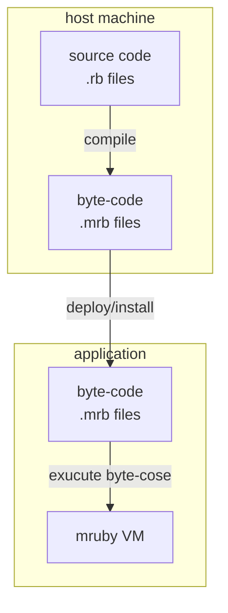

## Installation

VitalRouter.MRuby uses [MRubyCS](https://github.com/hadashiA/MRubyCS), a pure C# mruby VM implementation, from version 2 onwards.
Follow the steps below to install MRubyCS-related packages and the VitalRouter.MRuby package.

VitalRouter.MRuby v2 supports all platforms where C# runs.

### NuGet

Install following packages.

```bash
dotnet add MRubyCS 
dotnet add MRubyCS.Compiler 
dotnet add MRubyCS.Serializer 
dotnet add VitalRouter.MRuby 
```

### Unity

1. Install [NuGetForUnity](https://github.com/GlitchEnzo/NuGetForUnity)
2. Open the NuGet window by going to NuGet > Manage NuGet Packages, and install following packages.
  - MRubyCS
  - MRubyCS.Serializer
  - VitalRouter.MRuby
3. Install [MRubyCS.Compiler](https://github.com/hadashiA/MRubyCS?tab=readme-ov-file#mrubycscompiler) unity package.

## Getting Started

To execute mruby, first create a `MRubyState`.
All object creation and method execution in the mruby world happens through `MRubyState`.

```cs
using MRubyCS;

var mrb = MRubyState.Create();
```

When the VitalRouter.MRuby package is installed, the `MRubyState.DefineVitalRouter` extension method becomes available.

Register the `ICommand` implementations you want to publish through mruby scripts to the MRubyState.

```cs
mrb.DefineVitalRouter(x =>
{
    x.AddCommand<CharacterMoveCommand>("move");
    x.AddCommand<CharacterSpeakCommand>("speak");
});
```

The string arguments (like "move" or "speak") can be freely chosen as the names for handling commands from Ruby.

For the type parameter of `AddCommand`, specify any `ICommand` type you want to publish from Ruby.
Note that the types specified here require the `[MRubyObject]` attribute.


```cs
// Your custom command decralations
[MRubyObject]
partial struct CharacterMoveCommand : ICommand
{
    public string Id;
    public Vector3 To;
}

[MRubyObject]
partial struct CharacterSpeakCommand : ICommand
{
    public string Id;
    public string Text;
}
```

Now you can publish the above commands from Ruby.

For example, executing the following Ruby source code will publish a command.

```ruby
cmd :speak, id: 'Bob', text: 'Hello'
```

:::note
The execution result of this Ruby script is essentially equivalent to the following C# code:
```cs
await Router.Default.PublishAsync(new CharacterSpeakCommand
{
    Id = 'Bob',
    Text = 'Hello',
});
```
:::

To execute this, do the following:

```cs
var bytecode = File.ReadAllBytes("your_script.mrb");

await mrb.ExecuteAsync(Router.Default, mrb.ParseBytecode(bytecode));
```


In other words, the `cmd` in the Ruby world delegates processing to C# when executed, enters a suspended state, and resumes when the C# await completes.
This is done without blocking threads.

### MRubyCS.Compiler

Note that in VitalRouter.MRuby v2, the runtime part that executes Ruby bytecode is clearly separated from the "compiler" that converts Ruby source code to bytecode.

By excluding the Ruby "compiler" at application runtime, the runtime part is faster and more lightweight.



If the MRubyCS.Compiler package is included in your .NET or Unity project, you can execute Ruby source code as follows:

```cs
using MRubyCS.Compiler;

var source = """
def f(a)
  1 * a
end

f 100
"""u8;

var mrb = MRubyState.Create();
var compiler = MRubyCompiler.Create(mrb);

// Compile to irep (internal executable representation)
var irep = compiler.Compile(source);

// irep can be used later..
var result = mrb.Execute(irep); // => 100

// Compile to bytecode (mruby called this format is "Rite")
using var bin = compiler.CompileToBytecode(source);

// bytecode can be save a file or any other storage
File.WriteAllBytes("compiled.mrb", bin.AsSpan());

// Can be used later from file
mrb.LoadBytecode(File.ReadAllBytes("compiled.mrb")); //=> 100

// or, you can evaluate source code directly
result = compiler.LoadSourceCode("f(100)"u8);
result = compiler.LoadSourceCode("f(100)");
```

:::note
MRubyCS.Compiler is a package intended for use in build pipelines,
and currently only supports Windows, macOS, and Linux.

For example, in Unity, it is recommended to use it only in the Editor or build tools.
:::

In Unity, importing `.rb` source code under the Assets folder automatically generates `.mrb` bytecode as a sub-asset.
For details, see the [MRubyCS.Compiler](https://github.com/hadashiA/MRubyCS?tab=readme-ov-file#compiling-ruby-source-code) documentation.

### `[MRubyObject]`

Types marked with the `[MRubyObject]` attribute support mutual conversion with objects in the Ruby world.

This can be used for `ICommand` types registered to MRubyState with `AddCommand`,
as well as for values registered in `SharedVariableTable`.

C# types that can be converted to Ruby objects with the `[MRubyObject]` attribute must meet the following conditions:

- class, struct, and record are all supported.
- A partial declaration is required.
- Members that meet the following conditions are converted from mruby:
    - public fields or properties, or fields or properties with the [MRubyMember] attribute.
    - And have a setter (private is acceptable).

Ruby objects converted by this feature become `Hash` in the format `{ field1: value, field2: value }`.

For details, see the [MRubyCS.Serializer](https://github.com/hadashiA/MRubyCS?tab=readme-ov-file#mrubycsserializer) documentation.

### SharedVariableTable

You often want to share some data between Ruby scripts and C#.
Typically, this is when you want to reference state such as game flags from scripts and branch processing.

VitalRouter.MRuby has a feature called `SharedVariableTable` for this purpose.

For example, on the C# side, you can set arbitrary data by specifying a specific key as follows:

```cs
var shared = mrb.GetSharedVariables();

shared.Set("flag_a", new MRubyValue(true));
```

From Ruby, you can read data keyed as `"flag_a"` from the `state` method.

```ruby
if state[:flag_a]
  # flag_a is ON !
end
```

Conversely, setting data from the Ruby side is also supported.

```ruby
state[:flag_b] = true
```

In this case, you can read data keyed as `"flag_b"` from C#.

```cs
var shared = mrb.GetSharedVariables();
shared.GetOrDefault<bool>("flag_b") //=> true
```

All [types supported by MRubyCS.Serializer](https://github.com/hadashiA/MRubyCS?tab=readme-ov-file#builtin-supported-types) are available as data values.
All C# primitive types and basic collection types such as Array and Dictionary are supported.

User-defined types marked with `[MRubyObject]` can also be set in `SharedVariableTable`.

```cs
[MRubyObject]
class CustomSharedData
{
    public string Field1;
    public string Field2;    
}

sahred.Set("customdata", new CustomSharedData 
{ 
    Field1 = "hoge", 
    Field2 = "fuga"
});;
```

```ruby
state[:customdata][:field1] #=> "hoge"
state[:customdata][:field2] #=> "fuga"
```

You can also directly retrieve `MRubyValue`, which is a value in the mruby world.

```mruby
state[:a] = 1
```

```cs
var value = shared.GetAsMRubyValue("a");
value.IsIntegere //=> true
value.IntegerValue //=> 1
```

### Define Ruby Method from C#

MRubyCS is implemented in C#, and it is possible to define Ruby methods from C#.

Here is an example of defining a Ruby method in C# that takes one argument and calls underlying logging.

```cs
 mrb.DefineMethod(mrb.ObjectClass, mrb.Intern("log"), (mrb, self) =>
 {
     var message = mrb.GetArgumentAt(0);
     UnityEngine.Debug.Log(mrb.Stringify(message).ToString());
     return default;
 });
```

For details on the MRubyCS API, see the [MRubyCS](https://github.com/hadashiA/MRubyCS) documentation.

## Migration Guide

1. Uninstall VitalRouter (v1), VitalRouter.MRuby (v1) packages and install v2.
2. Replace `MRubyContext` to `MRubyState`.
  - If you were using MRubyContext or MRubyCompiler directly, you need to change to the new MRubyState and MRubyCompiler APIs.
  - For details, see [MRubyCS](https://github.com/hadashiA/MRubyCS).
3. Change `CommandPreset` definitions to `MRubyState.DefineVitalRouter`.
4. The built-in Ruby methods `log` and `wait` in v1 have been removed. If you want to continue using them, redefine them in MRubyState.

Example:

v1 (old)

```cs
[MRubyCommand("move", typeof(CharacterMoveCommand))]   // < Your custom command name and type list here 
[MRubyCommand("speak", typeof(CharacterSpeakCommand))]
partial class MyCommandPreset : MRubyCommandPreset { }

var context = MRubyContext.Create();
context.Router = Router.Default
context.CommandPreset = new MyCommandPreset());

using var script = context.CompileScript(rubySource);    
await script.RunAsync();
```

v2 
```cs
var mrb = MRubyState.Create();

mrb.DefineVitalRouter(x =>
{
    x.AddCommand<CharacterMoveCommand>("move");
    x.AddCommand<CharacterSpeakCommand>("speak");
});

var irep = compiler.Compile(rubySource);

mrb.ExecuteAsync(Router.Default, irep);
```

### Examples of defining additional methods

Example of defining a log method:

```cs
 mrb.DefineMethod(mrb.ObjectClass, mrb.Intern("log"), (_, self) =>
 {
     var message = mrb.GetArgumentAt(0);
     UnityEngine.Debug.Log(mrb.Stringify(message).ToString());
     return default;
 });
```

Usage example from Ruby:

```ruby
log 'This is a log'
```

Example of defining a wait method:

```cs
[MRubyObject]
public readonly partial record struct WaitCommand(int Seconds) : ICommand;
```

```cs
mrb.DefineVitalRouter(x =>
{
    x.AddCommand<WaitCommand>("wait");
});
```

```ruby
def wait(secs) = cmd :wait, seconds: secs

wait 1
```

