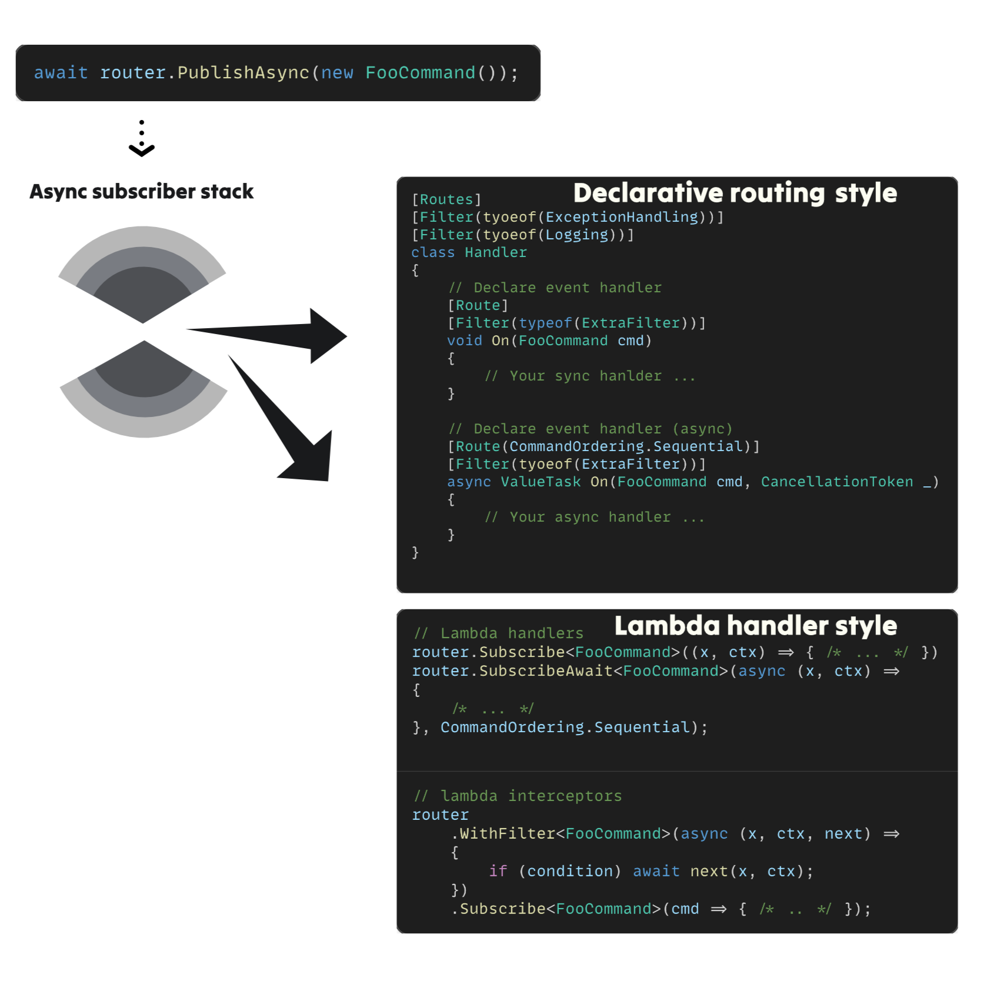
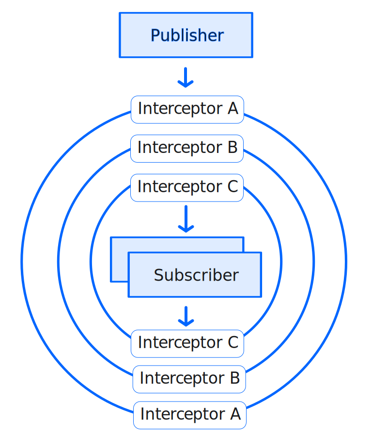
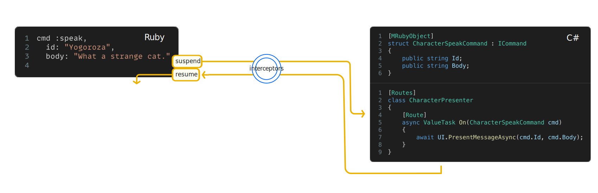

# VitalRouter

VitalRouter, is a source-generator powered zero-allocation fast in-memory messaging library for Unity and .NET.

It can declaratively do async handler/async middleware/sequence control, etc., and could serve as a thin framework to promote unidirectional control flow.



In games, or complex GUI application development, patterns such as central event aggregator/message broker/mediator are powerful patterns to organize N:N relationships.
Assembling an asynchronous function pipeline can be even more effective.

### Features

- Zero allocation message passing
- Thread-safe
- Pub/Sub, Fan-out
- Async / Non-async handlers 
- [Fast declarative routing pattern](./getting-started/declarative-routing-pattern) with source generator
- [Naive event handler pattern](./getting-started/event-handler-pattern)
- [Async interceptor pipelines](./pipeline/interceptor)
  - Parallel, queueing, or other [sequential control](./pipeline/sequential-control)
- [DI friendly](./di/vcontainer). Also support without DI.
- **Optional Extensions**
  - [UniTask support](./extensions/unitask)
  - [R3 integration](./extensions/r3)
  - [MRuby scripting!](./extensions/mruby)

## Declarative Routing

Message handlers can be defined declaratively by adding attribute to the class declaration.

[Read more](./getting-started/declarative-routing-pattern)

```cs
[Routes]
[Filter(typeof(Logging))]
[Filter(typeof(ExceptionHandling))]
[Filter(typeof(GameStateUpdating))]
public partial class ExamplePresenter
{
    // Declare event handler
    [Route]
    void On(FooCommand cmd)
    {
        // Do something ...
    }

    // Declare event handler (async)
    [Route] 
    async UniTask On(BarCommand cmd)
    {
        // Do something for await ...
    }
    
    // Declare event handler with extra filter
    [Route]
    [Filter(typeof(ExtraFilter))]
    async UniTask On(BuzCommand cmd, CancellationToken cancellation = default)
    {
        // Do something after all filters runs on.
    }
       
    // Declare event handler with specifies behavior when async handlers are executed concurrently
    [Route(CommandOrdering.Sequential)]
    async UniTask On(BuzCommand cmd, CancellationToken cancellation = default)
    {
        // Do something after all filters runs on.
    }
}
```

## Naive event handler

Similarly, the general pattern of simply registering event handlers is also supported.

[Read more](./getting-started/event-handler-pattern)

```cs
// Lambda handlers
var subscription = router.Subscribe<FooCommand>(cmd => { /* ... */ });

// Unsubscribe with `IDisposable`.
subscription.Dispose();
```

```cs
// Subscribe with async
var subscription = router.SubscribeAwait<FooCommand>(async (cmd, cancellationToken) => { /* ... */ }, CommandOrdering.Sequential);

// lambda interceptors
router
    .WithFilter<FooCommand>(async (x, context) =>
    {
        if (condition) await next(x, context);
    })
    .Subscribe<FooCommand>(cmd => { /* .. */ });
```

## Async interceptor pipeline

Pipelining of async interceptors for published messages is possible.
This is a general strong pattern for data exchange.

[Read more](./pipeline/interceptor)

<div style={{ width: '50%' }}>

</div>

## UniTask Integration

[UniTask](https://github.com/Cysharp/UniTask) is a fast async/await extension for Unity.
VitalRouter actively supports UniTask.

[Read more](./extensions/unitask)

## R3 Integration

[R3](https://github.com/Cysharp/) is the next generation Reactive Extensions implementation in the C# world.
It is an excellent alternative to asynchronous streams, but also an excellent alternative to local events.

VitalRouter supports the ability to work with R3.

[Read more](./extensions/r3)

## MRuby scripting?

It is very powerful if the publishing of commands can be controlled by external data.

For example, when implementing a game scenario, most of the time we do not implement everything in C# scripts. It is common to express large amounts of text data, branching, flag management, etc. in a simple scripting language or data format.

VitalRouter offers an optional package for this purpose before integrating. [mruby](https://github.com/mruby/mruby). ([blog](https://medium.com/@hadashiA/vitalrouter-mruby-generic-ruby-scripting-framework-for-unity-d1b2234a5c33) / [blog (Japanease)](https://scrapbox.io/hadashiA/VitalRouter.MRuby_-_Unity%E5%90%91%E3%81%91%E6%B1%8E%E7%94%A8Ruby%E3%82%B9%E3%82%AF%E3%83%AA%E3%83%97%E3%83%86%E3%82%A3%E3%83%B3%E3%82%B0%E3%83%95%E3%83%AC%E3%83%BC%E3%83%A0%E3%83%AF%E3%83%BC%E3%82%AF) )

Fiber in mruby and async/await in C# are fully integrated.



[Read more](./extensions/mruby)
 
## Performance

There is zero extra heap allocation due to publish; if `ICommand` is struct, no boxing occurs.
Also, if interceptor is used, type-specific allocations occur the first time, but are cached the second and subsequent times.
So it could be used for very granular messaging in games.

Below is a simple synchronous Publish benchmark.
Although this benchmark is different from the actual use case, it shows that the performance is very simple, fast, and on the same level as event substitution.

| Method                              | Mean        | Error     | StdDev     | Median      | Gen0   | Allocated |
|-------------------------------------|------------:|----------:|-----------:|------------:|-------:|----------:|
| Publish (VitalRouter)               |    83.31 ns |  0.802 ns |   0.750 ns |    83.39 ns |      - |         - |
| Publish (ZeroMessenger)             |    48.55 ns |  0.626 ns |   0.585 ns |    48.55 ns |      - |         - |
| Publish (MessagePipe)               |    63.77 ns |  0.853 ns |   0.756 ns |    63.69 ns |      - |         - |
| Publish (R3 Subject)                |    71.61 ns |  1.259 ns |   1.499 ns |    71.51 ns |      - |         - |
| Publish (System.Reactive Subject)   |    76.56 ns |  0.656 ns |   0.582 ns |    76.32 ns |      - |         - |
| Publish (MediatR)                   |   260.63 ns |  2.586 ns |   2.419 ns |   260.59 ns |      - |      64 B |
| Publish (PubSub)                    |   515.71 ns |  6.076 ns |   5.683 ns |   516.50 ns |      - |     248 B |
| Publish (Prism)                     | 1,374.80 ns | 39.718 ns | 103.232 ns | 1,334.21 ns | 0.1000 |    1552 B |

By source generator, type of ICommand branches are pre-generated by static type caching. This is particularly fast compared to switch statements and dictionaries.

```csharp
// Auto-generated example, Determination of subscriber
MethodTable<global::CharacterEnterCommand>.Value = static (source, command, cancellation) => source.On(command);
MethodTable<global::CharacterMoveCommand>.Value = static (source, command, cancellation) => source.On(command);

// Auto-generated example, Determination of interceptor
MethodTable<global::CharacterEnterCommand>.InterceptorFinder = static self => self.interceptorStackDefault;
MethodTable<global::CharacterMoveCommand>.InterceptorFinder = static self => self.interceptorStackDefault;
```

## Why In-Memory Messaging?

### Unidirectional control flow

Unity is a very fun game engine that is easy to work with, but handling communication between multiple GameObjects is a difficult design challenge.
In the game world, there are so many objects working in concert: UI, game system, effects, sounds, and various actors on the screen.
It is common for an event fired by one object to affect many objects in the game world. If we try to implement this in a naive OOP way, we will end up with complex... very complex N:N relationships.

More to the point, individual objects in the game are created and destroyed at a dizzying rate during execution, so this N:N would tend to be even more complex!
The issue here is this. There is no distinction between "the one giving the orders" and "the one being given the orders." In the simplicity of Unity programming, it is easy to mix up the object giving the orders and the object being given the orders. This is one of the reasons why game design is so difficult.
When the relationship is N:N, bidirectional binding is almost powerless. This is because it is very fat for an object to resolve references to all related objects. Moreover, they all repeat their creation.

Most modern GUI application frameworks recommend an overall unidirectional control flow rather than bidirectional binding.
Games are more difficult to generalize than GUIs. However, it is still important to organize the "control flow".


### Distinguish between publishable and encapsulated states

A major concern in game development is creating a Visualize Component that is unique to that game.
The Component we create has very detailed state transitions. It will move every frame. Maybe. It will have complex parent-child relationships. Maybe.
But we should separate this very detailed state management from the state that is brought to the entire game system and to which many objects react.

### Data-oriented 

An important advantage of giving a type for each type of event is that it is serializable.

For example,
If you store your commands in order, you can implement game replays later by simply re-publishing them in chronological order.
Commands across the network, your scenario data, editor data, whatever is datamined, are the same input data source.

A further data-oriented design advantage is the separation of "data" from "functionality.
The life of data is dynamic. Data is created/destroyed when certain conditions are met in a game. On the other hand, "functionality" has a static lifetime. This is a powerful tool for large code bases.

