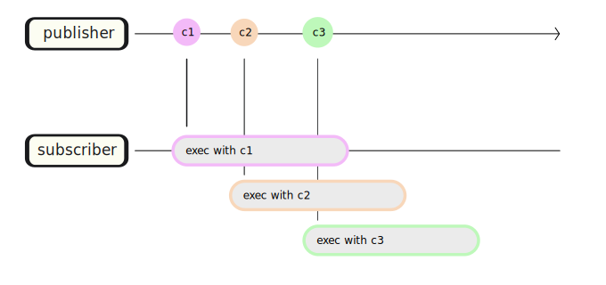
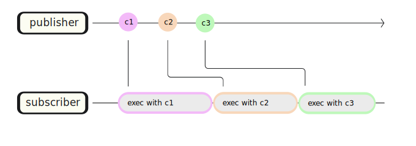
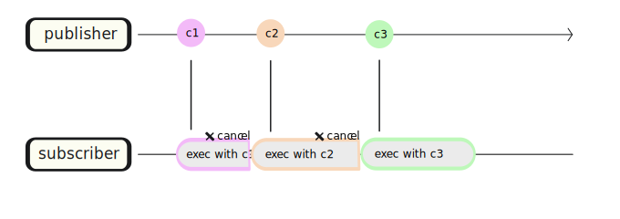

A method is provided to control the behavior of async handlers when they can be executed in duplicate.

It is possible to specify `CommandOrdering` at each level, such as per Router instance, SubscribeAwait argument, Route method, etc.

```cs
public enum CommandOrdering
{
    /// <summary>
    /// If commands are published simultaneously, subscribers are called in parallel.
    /// </summary>
    Parallel,

    /// <summary>
    /// If commands are published simultaneously, wait until the subscriber has processed the first command.
    /// </summary>
    Sequential,

    /// <summary>
    /// If commands are published simultaneously, ignore commands that come later.
    /// </summary>
    Drop,

    /// <summary>
    /// If the previous asynchronous method is running, it is cancelled and the next asynchronous method is executed.
    /// </summary>
    Switch,
}
```

### Parallel



### Sequential



### Drop


### Switch



## How to set


```cs
// Set sequential constraint to the globally.
Router.Default.AddFilter(CommandOrdering.Sequential);

// Or
var fifoRouter = new Router(CommandOrdering.Sequential);

// Or Configure sequential routing via DI
builder.RegisterVitalRouter(routing => 
{
    routing.CommandOrdering = CommandOrdering.Sequential;
});
```


```cs
// Command ordering per class level
[Routes(CommandOrdering.Sequential)]
public FooPresenter
{
    public async UniTask On(FooCommand cmd)
    {
    }
}
```

```cs
[Routes]
public FooPresenter
{
    // Command ordering per method level
    [Route(CommandOrdering.Sequential)]
    public async UniTask On(FooCommand cmd)
    {
    }
}
```

```cs
// Command ordering per per lambda expressions
router.SubscribeAwait(async (cmd, ctx) => 
{
    /* ... */
}, CommandOrdering.Sequential);
```
