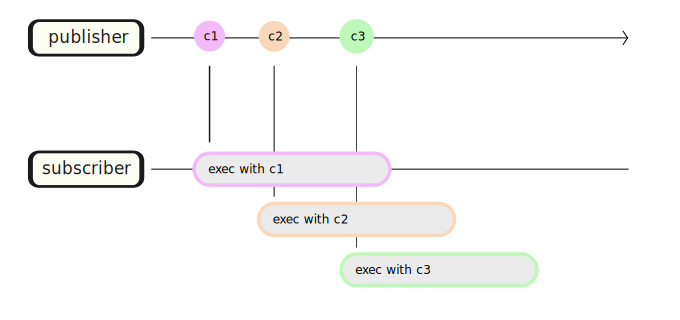
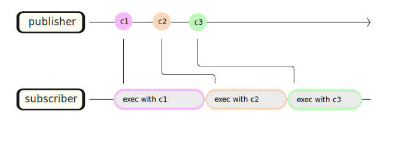
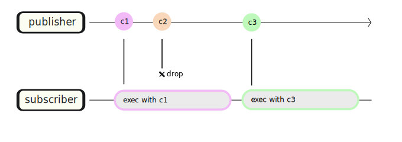
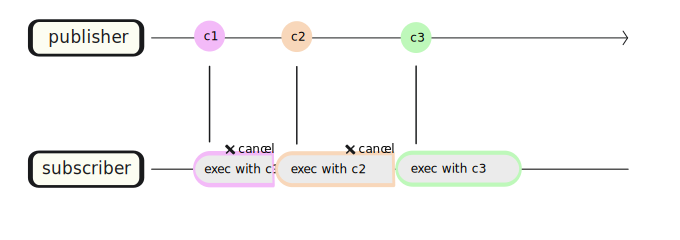

A method is provided to control the behavior of async handlers when they can be executed in duplicate.

It is possible to specify `CommandOrdering` at each level, such as per Router instance, SubscribeAwait argument, Route method, etc.

## Why it matters in games

In games, dialogue, cutscenes, and tutorials must play *in order* — never overlapping.
With `CommandOrdering.Sequential`, you just publish commands and VitalRouter plays them back-to-back, even across different command types.

```cs
public readonly record struct WalkCommand(Vector3 To) : ICommand;
public readonly record struct SpeakCommand(string Text) : ICommand;
public readonly record struct WaitCommand(float Seconds) : ICommand;

// `Sequential`: each command waits for the previous handler to finish.
[Routes(CommandOrdering.Sequential)]
public partial class CutscenePresenter : MonoBehaviour
{
    [Route]
    async UniTask On(WalkCommand cmd) => await character.WalkToAsync(cmd.To);

    [Route]
    async UniTask On(SpeakCommand cmd) => await dialogueView.ShowAsync(cmd.Text);

    [Route]
    async UniTask On(WaitCommand cmd) => await UniTask.Delay(TimeSpan.FromSeconds(cmd.Seconds));
}
```

```cs
// Fire-and-forget. VitalRouter queues these and runs them strictly in order.
router.PublishAsync(new WalkCommand(stage.Center));
router.PublishAsync(new SpeakCommand("Hello there!"));
router.PublishAsync(new WaitCommand(0.5f));
router.PublishAsync(new SpeakCommand("Welcome to our little town."));
```

Without ordering, all four handlers would start at the same time and the scene would be a mess.
With `Sequential`, the character walks in, *then* speaks, *then* pauses, *then* speaks again — no manual coroutine chaining or hand-rolled state machine required.

| Ordering              | Behavior                                          | Typical use                                         |
| :-------------------- | :------------------------------------------------ | :-------------------------------------------------- |
| `Parallel` (default)  | Run all handlers concurrently                     | Independent reactions                               |
| `Sequential`          | Queue, then run one at a time in order            | Dialogue, cutscenes, tutorials                      |
| `Drop`                | Ignore new commands while one is still running    | Debounce buttons, prevent double-firing             |
| `Switch`              | Cancel the running handler, start the new one     | "Latest wins" — re-targeting, search-as-you-type    |

```cs
public enum CommandOrdering
{
    /// <summary>
    /// If commands are published simultaneously, subscribers are called in parallel.
    /// </summary>
    Parallel,

    /// <summary>
    /// If commands are published simultaneously, wait until the subscriber has processed the first command.
    /// </summary>
    Sequential,

    /// <summary>
    /// If commands are published simultaneously, ignore commands that come later.
    /// </summary>
    Drop,

    /// <summary>
    /// If the previous asynchronous method is running, it is cancelled and the next asynchronous method is executed.
    /// </summary>
    Switch,
}
```

### Parallel



### Sequential



### Drop



### Switch



## How to set


```cs
// Set sequential constraint to the globally.
Router.Default.AddFilter(CommandOrdering.Sequential);

// Or
var fifoRouter = new Router(CommandOrdering.Sequential);

// Or Configure sequential routing via DI
builder.RegisterVitalRouter(routing => 
{
    routing.CommandOrdering = CommandOrdering.Sequential;
});
```


```cs
// Command ordering per class level
[Routes(CommandOrdering.Sequential)]
public FooPresenter
{
    public async UniTask On(FooCommand cmd)
    {
    }
}
```

```cs
[Routes]
public FooPresenter
{
    // Command ordering per method level
    [Route(CommandOrdering.Sequential)]
    public async UniTask On(FooCommand cmd)
    {
    }
}
```

```cs
// Command ordering per per lambda expressions
router.SubscribeAwait(async (cmd, ctx) => 
{
    /* ... */
}, CommandOrdering.Sequential);
```
